# C# Deep Dive Project Documentation

## 📋 Project Overview

This project is an educational C# console application designed to demonstrate advanced C# concepts, specifically focusing on:
- **Reference Types vs Value Types**
- **Struct Implementation and Usage**
- **Enum Usage and Manipulation**
- **Memory Management Concepts**
- **Type System Understanding**

The project serves as a learning resource for understanding fundamental C# type system behaviors and advanced programming concepts.

## 🏗️ Project Architecture

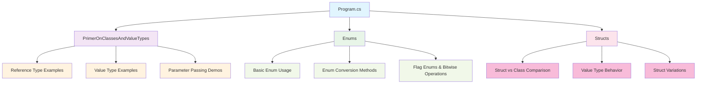

## 🎯 Core Learning Concepts

### 1. Reference Types vs Value Types

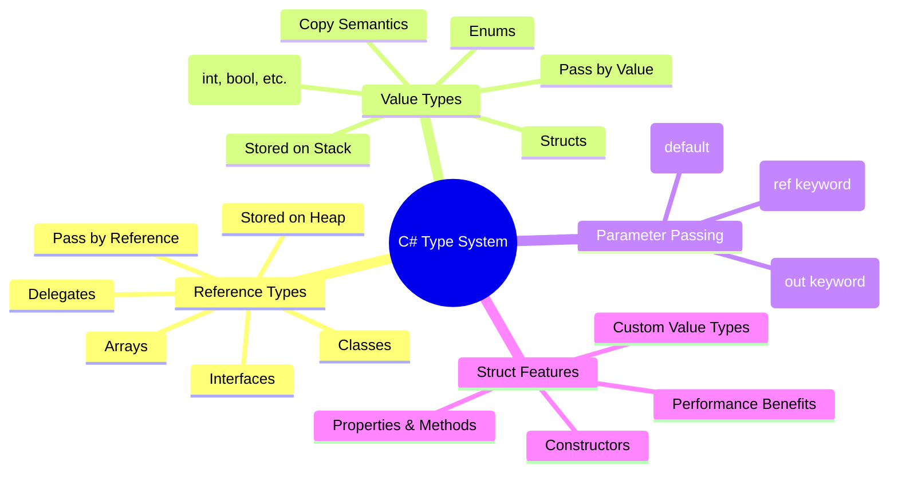

### 2. Memory Allocation Model

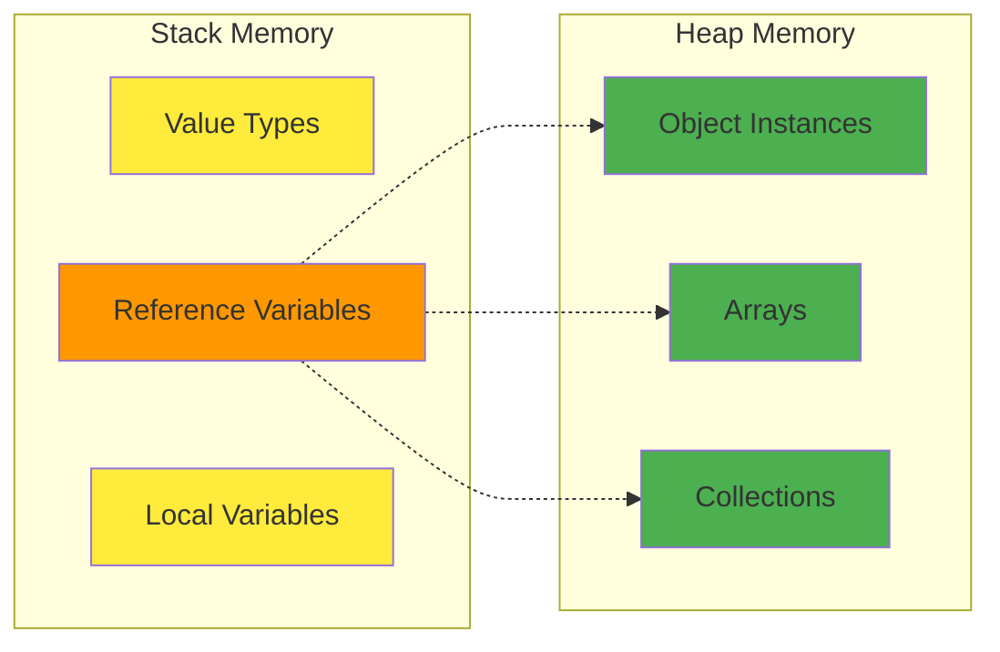

## 🔧 Project Structure

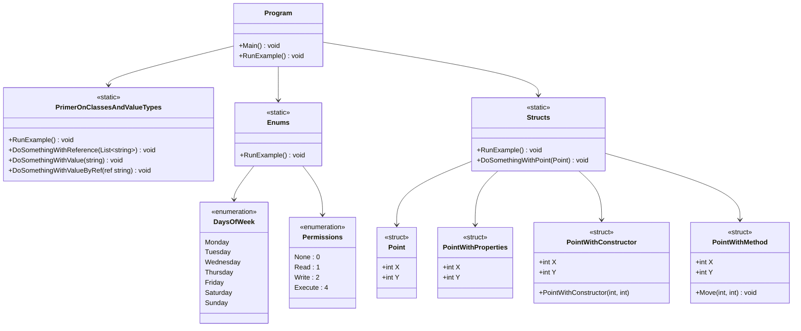

## 🎮 Execution Flow

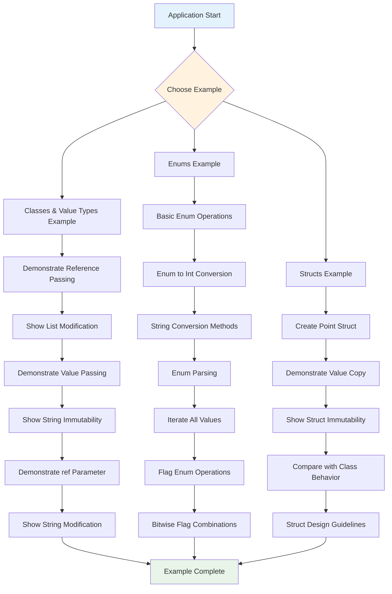

## 📚 Key Learning Points

### Reference Types Behavior
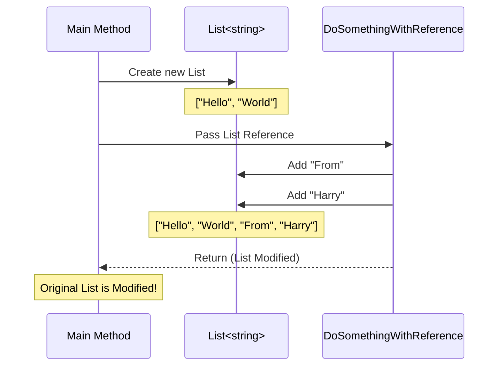

### Value Types Behavior
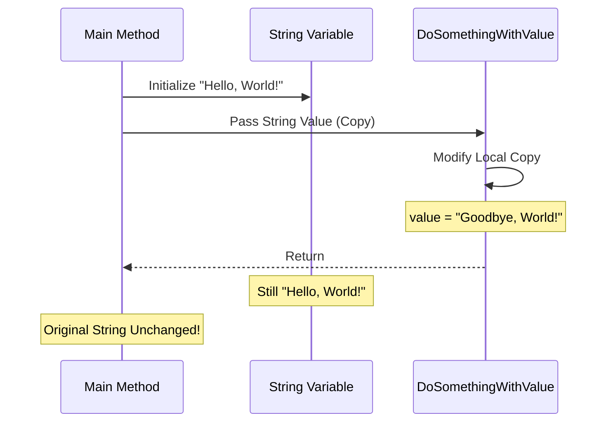

### Struct Behavior
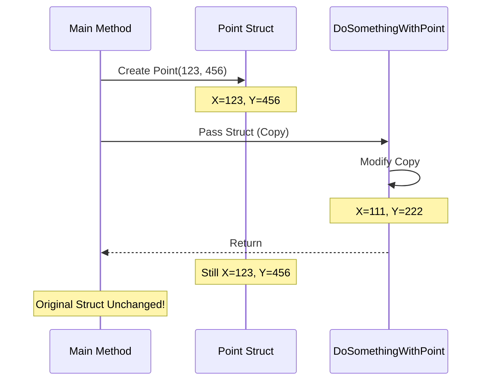

### Enum Operations Flow
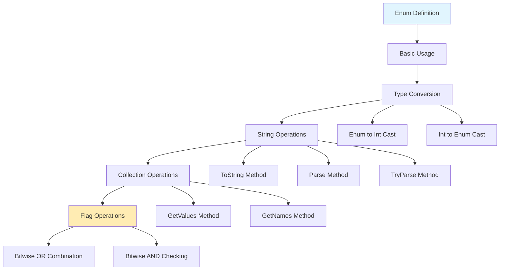

### Struct vs Class Comparison
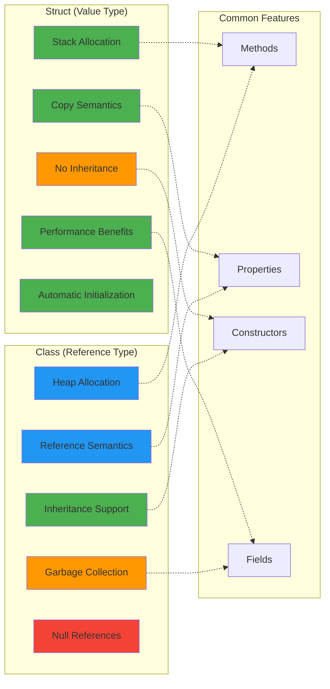

## 🛠️ Technical Specifications

| Component | Technology | Purpose |
|-----------|------------|---------|
| **Runtime** | .NET 8.0 | Modern C# runtime environment |
| **Language Features** | C# 12 | Latest language features and syntax |
| **Project Type** | Console Application | Simple executable for demonstrations |
| **Architecture** | Static Classes | Organized educational modules |
| **Struct Examples** | Custom Value Types | Point, PointWithProperties, etc. |

## 🎯 Educational Objectives

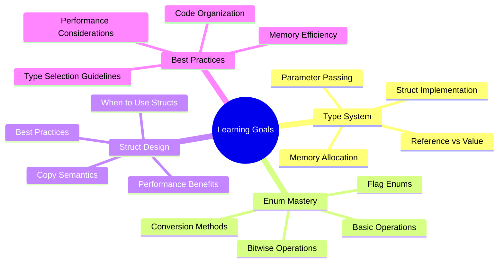

## 🚀 How to Run

1. **Prerequisites**: .NET 8.0 SDK installed
2. **Build**: `dotnet build`
3. **Run**: `dotnet run`
4. **Modify**: Comment/uncomment examples in `Program.cs`

## 📖 Code Examples Summary

### Reference Type Example
- Demonstrates how passing a `List<string>` allows the method to modify the original collection
- Shows that reference types store addresses, not actual data

### Value Type Example  
- Shows how passing a `string` creates a copy, leaving the original unchanged
- Demonstrates the `ref` keyword to pass value types by reference

### Enum Examples
- Basic enum definition and usage
- Conversion between enums, integers, and strings
- Flag enums with bitwise operations
- Enum reflection and introspection methods

### Struct Examples
- Custom value type implementation with Point struct
- Demonstrates copy semantics when passing structs to methods
- Shows different struct variations: fields, properties, constructors, methods
- Compares struct vs class behavior and performance characteristics

## 🔍 Advanced Concepts Covered

1. **Memory Management**: Stack vs Heap allocation
2. **Parameter Passing**: By value, by reference, and output parameters  
3. **Type Safety**: Compile-time vs runtime type checking
4. **Performance**: Implications of value vs reference type choices
5. **Bitwise Operations**: Flag enums and binary arithmetic
6. **Struct Design**: When and how to create custom value types
7. **Copy Semantics**: Understanding how structs behave differently from classes

## 📊 Struct Design Guidelines

### When to Use Structs
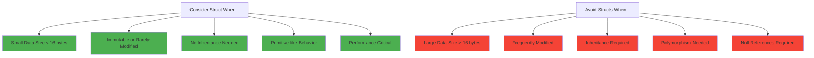

### Struct Implementation Patterns
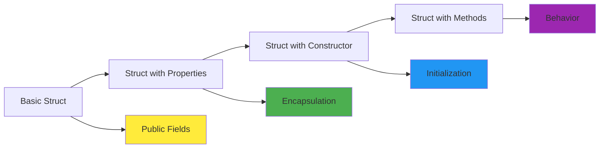

This project serves as a comprehensive foundation for understanding C#'s type system and provides practical examples of advanced programming concepts in action.
